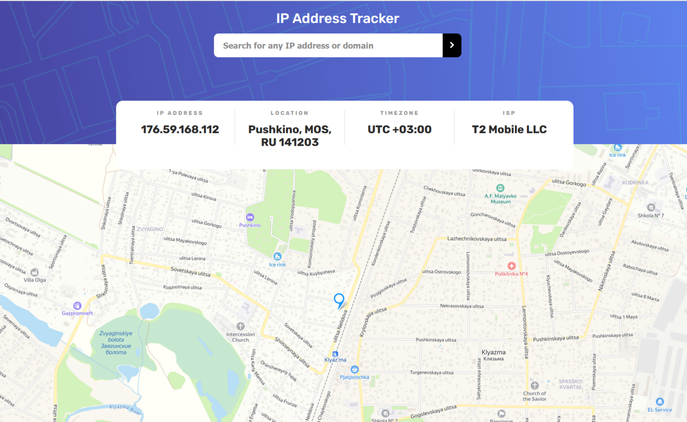
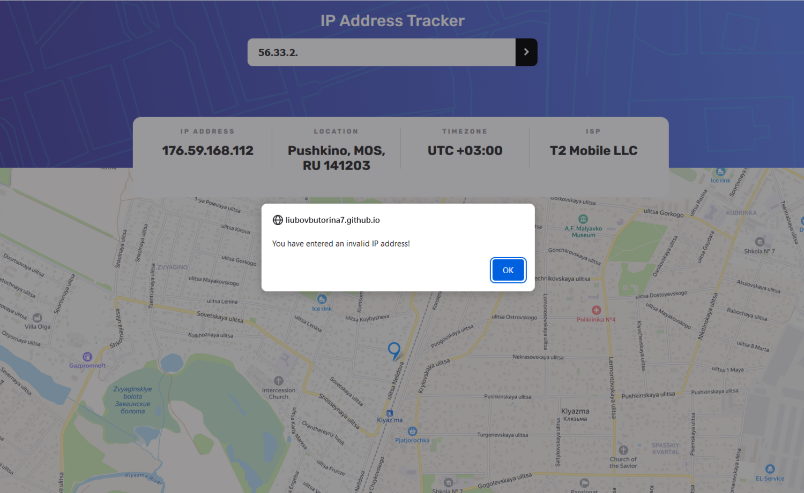
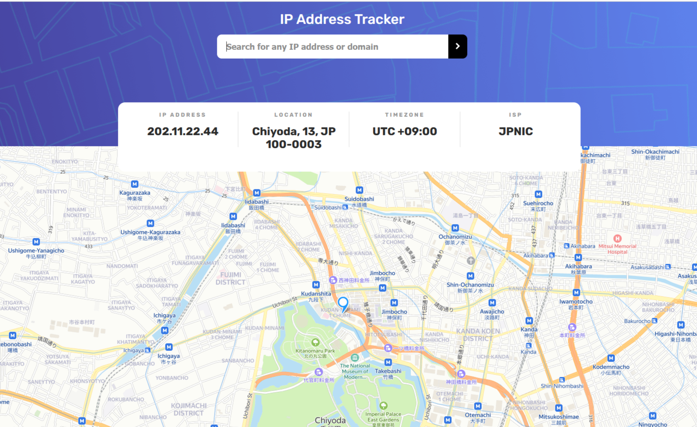
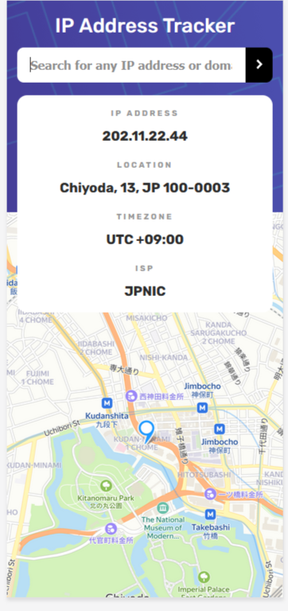

# IP address tracker Project

This is a solution to the [IP address tracker challenge on Frontend Mentor](https://www.frontendmentor.io/challenges/ip-address-tracker-I8-0yYAH0). 

- [DEMO](https://liubovbutorina7.github.io/ip-address-tracker/)

## Application functionality:

- Users see their own IP address, geolocation of their device and information about the provider on the map on the initial page load
- Users can search for any IP addresses and see the key information and location

## Built with:

- Semantic HTML5 markup
- CSS custom properties
- JavaScript
- Flexbox
- IP Geolocation API
- YandexMaps API (JSAPI 2.1)
- Parcel

## Resources:

- [IP Geolocation API](https://ipwhois.io/)
- [YandexMaps API](https://yandex.ru/dev/jsapi-v2-1/doc/ru/)

## Screenshorts:

## Author:

_Liubov Butorina_
